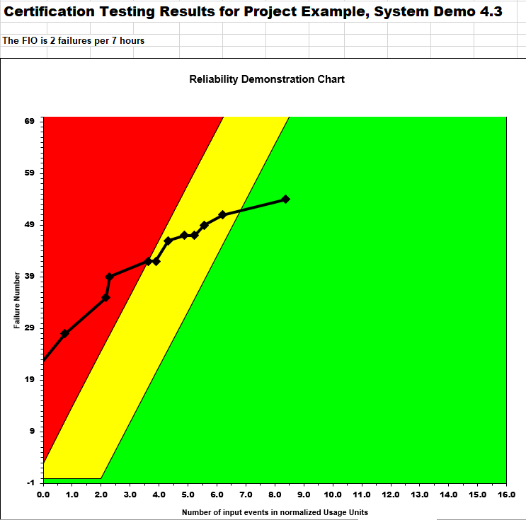
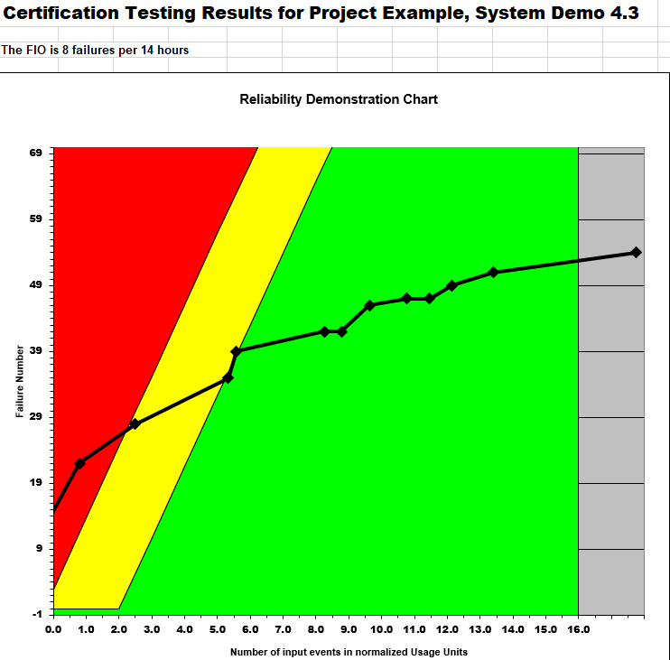
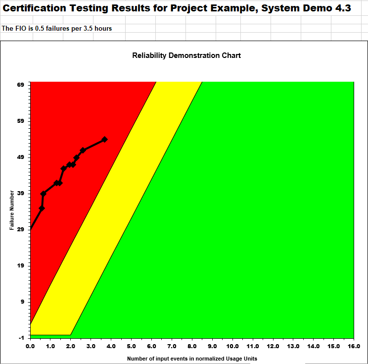

**SENG 438- Software Testing, Reliability, and Quality**

**Lab. Report \#5 – Software Reliability Assessment**

| Group \#24:       |   |
|-----------------|---|
| Student Names:  | Ahad Ali  |
|                 | Mushtaba Al Yasseen  |
|                 | Parbir Lehal  |
|                 | Athul Rajagopal  |

# Introduction
In this lab, our primary focus was to use tools such as C-SFRAT and Reliability Demonstration Chart (RDC) with Excel to help us conduct a reliability assessment of the SUT as measured by using one of the provided sample failure test files. In this lab, in the first part, we used C-SFRAT to assess failure data using reliability growth testing which helped us stress the SUT to identify failure modes and weaknesses through a systematic process. In the second part, we assessed failure data using a reliability assessment using the RDC tool, which helped ensure that the same results were given each time in the same setting from an assessment instrument like RDC with Excel. Overall, these tools and applications helps us apply what we learned in lectures about reliability testing and its importance when considering software testing and reliability. 

# Assessment Using Reliability Growth Testing 

## Result of model comparison (selecting top two models)

Upon importing the data of the system under test into C-SFRAT, we first selected all possible hazard functions, as well as all possible covariates to make sure that we generate every applicable model for comparison. The covariates include all the data on the number of defects detected in discrete time intervals. Thus, by making sure we select all possible hazard functions and covariates, we are able to generate/predict models with an accurate goodness of fit. After generating all possible combinations of hazard functions and covariates, we can compare the results in the model comparison tab. The model comparison tab is where we were able to select all applicable model results to compare and rank them based on their accuracy. In order to pick the top two models, we then ranked the models from highest to lowest based on `Log-Likelihood`, where the top two models turned out to be `S-Distribution` and `Negative Binomial (Order 2)`.

## Result of range analysis (an explanation of which part of the data is good for proceeding with the analysis)

Log-Likelihood allowed us to single out the top two models, with statistically, the best and most accurate goodness of fit. In the end, the top two models turned out to be `S-Distribution` with a Log-Likelihood of `-27.137`, and `Negative Binomial (Order 2)` with a Log-Likelihood of `-27.287`. Thus, it became clear that upon ranking the models and covariates, the best range to use moving forward included using the results of the models above, as well as the specific data covariates of execution time in hrs (E), failure id work in person hrs (F), and computer time id failure in hrs (C).

## Plots for failure rate and reliability of the SUT for the test data provided

### Time-Between-Failures (`S-Distribution`)

### Time-Between-Failures (`Negative Binomial (Order 2)`)

### Failure Intensity (`S-Distribution`)

### Failure Intensity (`Negative Binomial (Order 2)`)

### Reliability Graph

## A discussion on decision making given a target failure rate

To help us determine a target failure rate, our team utilized the C-SFRAT tool. After a dicussion with current and former students, we were able to determine a target failure rate by dividing the total number of intervals by the total number of failures encountered by the SUT as per the failure test data file used. More specifically, this means to use the last value of the T column and divide it by the sum of the FC column. As such, this comes out to `17 / 54` or a target failure rate of `0.3148` as can be seen in the screenshot above. This aligns with our goal to have the lowest possible target failure rate to ensure reliability of the SUT given the failure data file. When provided this number into C-SFRAT as the `Failure Intensity Target` field, the tool was able to predict the number of additional intervals to achieve that value. Therefore, to achieve a failure intensity of `0.3148`, both the S Distribution and Negative Binomial (Order 2) models with E, F, and C covariates predicts one additional interval would be required as shown above. As such, based on the SUT described by the failure data file, with the target failure rate, the SUT should be reliable. This value was confirmed by the TA who conducted our demo and the [provided article](https://www.sciencedirect.com/science/article/pii/S2352711021001588) from the TA discussion post.

## A discussion on the advantages and disadvantages of reliability growth analysis

### Advantages

- Helps with the early identification of potential reliability issues as you do this during the development process, thus catching potential issues early before they become bigger and worse problems.
- Also helps with better resource allocation as the developer will focus on areas most critical to the overall reliability of the SUT by identifiying and prioritizing reliability issues.
- Finally, helps with improving system or SUT quality as it adresses reliability issues earlier in the development process. This not only improves the SUT's overall quality but also reduces the need for costly and more time-consuming fixing and refactoring had the issues been discovered later.

### Disadvantages
- The biggest or most prominent disadvantage we found was that it is very tedious and time consuming to analyze the reliability of the SUT and it requires a lot of data collection and analysis.
- Second, it has limited potential or scope as there are assumptions used and the SUT is not necessarily expected to act as the provided failure data at all times. In addition, while considering reliability, we do not consider other important factors like perforamnce, security or usability.
- Finally, it can be incredibly costly. Since reliability growth analysis requires specialized tools and specialized expertise individuals, conducting such an analysis could be very expensive.

# Assessment Using Reliability Demonstration Chart 

## 3 plots for MTTFmin, twice and half of it for your test data

### MTTFmin 

Note that the MTTFmin is 3.5 hours, and thus our corresponding FIO is 2 failures per 7 hours.

### Twice MTTFmin

Note that twice the MTTFmin is 7 hours, and thus our corresponding FIO is 8 failures per 14 hours.

### Half MTTFmin

Note that half the MTTFmin is 1.75 hours, and thus our corresponding FIO is 0.5 failures per 3.5 hours.

## Explain your evaluation and justification of how you decide on the MTTFmin

The MTTF (Mean Time To Failure) is a statistical measure of the expected time between failures of a system. It is calculated as the reciprocal of the failure rate, which is the number of failures that occur in a specific period divided by the total operating time. Since the failure rate in the RDC spreadsheet is represented by the failure intensity objective (FIO), the MTTF would be the inverse of the minimum acceptabe FIO. Thus, our objective was to find the minimum FIO with which the system would be acceptable. Through trial and error, we found that with an FIO of 2 failures per 7 hours, the R-Demo-Chart crosses into the acceptable region in the last data point. Thus, our MTTFmin is the inverse of 2/7, or in other words, 3.5 hours.

## A discussion on the advantages and disadvantages of RDC
 
## Advantages
* **Considers multi-failure systems,** where it's usually difficult to satisfy situations where all failure experiences are in the accepted region by providing a **visual representation.**
* Allows for identification of potential reliability issues where understanding the acceptable, continue, and failure ranges using a constraint, **decision-making** is more clear and objective.
* With respect to the second bullet point, using RDC **reduces costs** and is an effective way of testing reliability because only a small sample size is needed to produce clear results.

## Disadvantages
* Must **assume constant failure rate (MTTF)** hence the linearity of the three regions. Due to the erratic nature of products, it may not be realistic as the product progresses in its lifecycle. 
* With respect to the first bullet point, RDC cannot be accurately used for **complex products/systems** where a larger data size is needed to accurately produce results
* RDC only addresses the probability of failure, and **does not address other aspects of reliability.** For example, does not address maintainability, availability, etc.

# Comparison of Results with Part 1

# Discussion on Similarity and Differences of the Two Techniques

# How the team work/effort was divided and managed

# Difficulties encountered, challenges overcome, and lessons learned
Our group encountered a lot of difficulties in the setup of the lab and provided software. With the the rather vague instructions and guidance on the lab, our group had spent unnecessary amounts of time just setting up the data for Part 1 and with the initial setup rather than on the lab content and application of lectures. We overcame these set up challenges by communicating with fellow and former students to help us complete the lab. In addition, we reached out to several TAs for help on the lab. As for lessons learned, we learned how to use the different tools suggested to accurately measure the reliability of a system. However, these tools are only a simulation of how the system should ideally behave. Another lesson learned was how there is a rather high learning curve just to learn the tools to measure the reliability of the system. However, encountering these tools now will hopefully benefit us later as we use tools with higher learning curves.

# Comments/feedback on the lab itself

Overall, this lab was by far the most confusing of the five assignments this semester. Due to the lack of experience with tools such as C-SFRAT and the very little vague instructions, a bunch of time was lost trying to format the data, and to get the tools to function properly. Tools such as C-SFRAT were recommended tools as part of this lab, and since examples covered during lecture were done using older tools, we spent a large amount of time emailing and communicating with TAs in order to get the tools to function properly. Ultimately, we were able to get over the obstacle of confusion after some communication with TAs and their discussion post on D2L. However, we feel that this could all have been avoided if the information that the TAs provided us later on was given at a much earlier date, and included as part of the instructions. Similarly, tools that are recommended in the lab could also be shown as part of examples in lectures, as the older “non-recommended” tools are eventually the ones that are not used in practice in the lab assignments.
